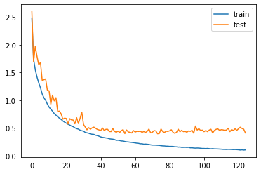

```python
import keras
from keras.datasets import cifar10
from keras.preprocessing.image import ImageDataGenerator
from keras.models import Sequential
from keras.utils import np_utils
from keras.layers import Dense, Activation, Flatten, Dropout, BatchNormalization,Conv2D, MaxPooling2D
from keras.callbacks import ModelCheckpoint 
from keras import regularizers, optimizers
import numpy as np
from matplotlib import pyplot
from keras.layers import LeakyReLU
from tensorflow.keras.optimizers import Adam

```


```python
(x_train,y_train),(x_test,y_test) = cifar10.load_data()
x_val =  x_test[5000:]
y_val =  y_test[5000:]
x_test = x_test[:5000]
y_test = y_test[:5000]
```

    Downloading data from https://www.cs.toronto.edu/~kriz/cifar-10-python.tar.gz
    170500096/170498071 [==============================] - 23s 0us/step
    170508288/170498071 [==============================] - 23s 0us/step


```python
mean = np.mean(x_train,axis = (0,1,2,3))
std = np.std(x_train,axis = (0,1,2,3))
x_train = (x_train - mean)/(std+1e-7)
x_test = (x_test - mean)/(std+1e-7)
x_val = (x_val - mean)/(std+1e-7)
```


```python
num_classes = 10
y_train = np_utils.to_categorical(y_train,num_classes=num_classes)
y_test = np_utils.to_categorical(y_test,num_classes=num_classes)
y_val = np_utils.to_categorical(y_val,num_classes=num_classes)
x_train.shape
```


    (50000, 32, 32, 3)


```python
model = Sequential()

# CONV 1
model.add(Conv2D(filters = 64,kernel_size=3,padding = "same",input_shape = (32,32,3),kernel_regularizer=regularizers.l2(0.0001)))
model.add(Activation('relu'))
model.add(BatchNormalization())

# CONV 2
model.add(Conv2D(filters = 64,kernel_size=3,padding = "same",kernel_regularizer=regularizers.l2(0.0001)))
model.add(Activation('relu'))
model.add(BatchNormalization())

# POOL + DROP
model.add(MaxPooling2D(pool_size = (2,2)))
model.add(Dropout(0.3))

# CONV 3
model.add(Conv2D(filters = 128,kernel_size=3,padding = "same",kernel_regularizer=regularizers.l2(0.0001)))
model.add(Activation('relu'))
model.add(BatchNormalization())

# CONV 4
model.add(Conv2D(filters = 128,kernel_size=3,padding = "same",kernel_regularizer=regularizers.l2(0.0001)))
model.add(Activation('relu'))
model.add(BatchNormalization())

# CONV 4
model.add(Conv2D(filters = 128,kernel_size=3,padding = "same",kernel_regularizer=regularizers.l2(0.0001)))
model.add(Activation('relu'))
model.add(BatchNormalization())

# POOL + DROP
model.add(MaxPooling2D(pool_size = (2,2)))
model.add(Dropout(0.3))

# CONV 5 
model.add(Conv2D(filters = 256,kernel_size=3,padding = "same",kernel_regularizer=regularizers.l2(0.0001)))
model.add(Activation('relu'))
model.add(BatchNormalization())

# CONV 6
model.add(Conv2D(filters = 256,kernel_size=3,padding = "same",kernel_regularizer=regularizers.l2(0.0001)))
model.add(Activation('relu'))
model.add(BatchNormalization())

# CONV 7
model.add(Conv2D(filters = 256,kernel_size=3,padding = "same",kernel_regularizer=regularizers.l2(0.0001)))
model.add(Activation('relu'))
model.add(BatchNormalization())

# NN
model.add(Flatten())

model.add(Dense(1024))
model.add(Activation('relu'))
model.add(BatchNormalization())

model.add(Dense(1024))
model.add(Activation('relu'))
model.add(BatchNormalization())

model.add(Dense(10,activation = "softmax"))

model.summary()
```

    Model: "sequential"
    _________________________________________________________________
    Layer (type)                 Output Shape              Param #   
    =================================================================
    conv2d (Conv2D)              (None, 32, 32, 64)        1792      
    _________________________________________________________________
    activation (Activation)      (None, 32, 32, 64)        0         
    _________________________________________________________________
    batch_normalization (BatchNo (None, 32, 32, 64)        256       
    _________________________________________________________________
    conv2d_1 (Conv2D)            (None, 32, 32, 64)        36928     
    _________________________________________________________________
    activation_1 (Activation)    (None, 32, 32, 64)        0         
    _________________________________________________________________
    batch_normalization_1 (Batch (None, 32, 32, 64)        256       
    _________________________________________________________________
    max_pooling2d (MaxPooling2D) (None, 16, 16, 64)        0         
    _________________________________________________________________
    dropout (Dropout)            (None, 16, 16, 64)        0         
    _________________________________________________________________
    conv2d_2 (Conv2D)            (None, 16, 16, 128)       73856     
    _________________________________________________________________
    activation_2 (Activation)    (None, 16, 16, 128)       0         
    _________________________________________________________________
    batch_normalization_2 (Batch (None, 16, 16, 128)       512       
    _________________________________________________________________
    conv2d_3 (Conv2D)            (None, 16, 16, 128)       147584    
    _________________________________________________________________
    activation_3 (Activation)    (None, 16, 16, 128)       0         
    _________________________________________________________________
    batch_normalization_3 (Batch (None, 16, 16, 128)       512       
    _________________________________________________________________
    conv2d_4 (Conv2D)            (None, 16, 16, 128)       147584    
    _________________________________________________________________
    activation_4 (Activation)    (None, 16, 16, 128)       0         
    _________________________________________________________________
    batch_normalization_4 (Batch (None, 16, 16, 128)       512       
    _________________________________________________________________
    max_pooling2d_1 (MaxPooling2 (None, 8, 8, 128)         0         
    _________________________________________________________________
    dropout_1 (Dropout)          (None, 8, 8, 128)         0         
    _________________________________________________________________
    conv2d_5 (Conv2D)            (None, 8, 8, 256)         295168    
    _________________________________________________________________
    activation_5 (Activation)    (None, 8, 8, 256)         0         
    _________________________________________________________________
    batch_normalization_5 (Batch (None, 8, 8, 256)         1024      
    _________________________________________________________________
    conv2d_6 (Conv2D)            (None, 8, 8, 256)         590080    
    _________________________________________________________________
    activation_6 (Activation)    (None, 8, 8, 256)         0         
    _________________________________________________________________
    batch_normalization_6 (Batch (None, 8, 8, 256)         1024      
    _________________________________________________________________
    conv2d_7 (Conv2D)            (None, 8, 8, 256)         590080    
    _________________________________________________________________
    activation_7 (Activation)    (None, 8, 8, 256)         0         
    _________________________________________________________________
    batch_normalization_7 (Batch (None, 8, 8, 256)         1024      
    _________________________________________________________________
    flatten (Flatten)            (None, 16384)             0         
    _________________________________________________________________
    dense (Dense)                (None, 1024)              16778240  
    _________________________________________________________________
    activation_8 (Activation)    (None, 1024)              0         
    _________________________________________________________________
    batch_normalization_8 (Batch (None, 1024)              4096      
    _________________________________________________________________
    dense_1 (Dense)              (None, 1024)              1049600   
    _________________________________________________________________
    activation_9 (Activation)    (None, 1024)              0         
    _________________________________________________________________
    batch_normalization_9 (Batch (None, 1024)              4096      
    _________________________________________________________________
    dense_2 (Dense)              (None, 10)                10250     
    =================================================================
    Total params: 19,734,474
    Trainable params: 19,727,818
    Non-trainable params: 6,656
    _________________________________________________________________


```python
model = Sequential()

# CONV 1
model.add(Conv2D(filters = 64,kernel_size=3,padding = "same",input_shape = (32,32,3)))
model.add(Activation('relu'))
model.add(BatchNormalization())


# CONV 2
model.add(Conv2D(filters = 64,kernel_size=3,padding = "same"))
model.add(Activation('relu'))
model.add(BatchNormalization())


# POOL + DROP
model.add(MaxPooling2D(pool_size = (2,2)))
model.add(Dropout(0.3))

# CONV 3
model.add(Conv2D(filters = 128,kernel_size=3,padding = "same"))
model.add(Activation('relu'))
model.add(BatchNormalization())


# CONV 4
model.add(Conv2D(filters = 128,kernel_size=3,padding = "same"))
model.add(Activation('relu'))
model.add(BatchNormalization())


# CONV 4
model.add(Conv2D(filters = 128,kernel_size=3,padding = "same"))
model.add(Activation('relu'))
model.add(BatchNormalization())

# POOL + DROP
model.add(MaxPooling2D(pool_size = (2,2)))
model.add(Dropout(0.3))

# CONV 5 
model.add(Conv2D(filters = 256,kernel_size=3,padding = "same"))
model.add(Activation('relu'))
model.add(BatchNormalization())

# CONV 6
model.add(Conv2D(filters = 256,kernel_size=3,padding = "same"))
model.add(Activation('relu'))
model.add(BatchNormalization())

# CONV 7
model.add(Conv2D(filters = 256,kernel_size=3,padding = "same"))
model.add(Activation('relu'))
model.add(BatchNormalization())

#POOL + DROP
model.add(MaxPooling2D(pool_size=(2,2)))
model.add(Dropout(0.4))


# NN
model.add(Flatten())

#model.add(Dense(1024))
#model.add(Activation('relu'))


model.add(Dense(10,activation = "softmax"))

model.summary()
```

    Model: "sequential_4"
    _________________________________________________________________
    Layer (type)                 Output Shape              Param #   
    =================================================================
    conv2d_32 (Conv2D)           (None, 32, 32, 64)        1792      
    _________________________________________________________________
    activation_36 (Activation)   (None, 32, 32, 64)        0         
    _________________________________________________________________
    batch_normalization_10 (Batc (None, 32, 32, 64)        256       
    _________________________________________________________________
    conv2d_33 (Conv2D)           (None, 32, 32, 64)        36928     
    _________________________________________________________________
    activation_37 (Activation)   (None, 32, 32, 64)        0         
    _________________________________________________________________
    batch_normalization_11 (Batc (None, 32, 32, 64)        256       
    _________________________________________________________________
    max_pooling2d_10 (MaxPooling (None, 16, 16, 64)        0         
    _________________________________________________________________
    dropout_10 (Dropout)         (None, 16, 16, 64)        0         
    _________________________________________________________________
    conv2d_34 (Conv2D)           (None, 16, 16, 128)       73856     
    _________________________________________________________________
    activation_38 (Activation)   (None, 16, 16, 128)       0         
    _________________________________________________________________
    batch_normalization_12 (Batc (None, 16, 16, 128)       512       
    _________________________________________________________________
    conv2d_35 (Conv2D)           (None, 16, 16, 128)       147584    
    _________________________________________________________________
    activation_39 (Activation)   (None, 16, 16, 128)       0         
    _________________________________________________________________
    batch_normalization_13 (Batc (None, 16, 16, 128)       512       
    _________________________________________________________________
    conv2d_36 (Conv2D)           (None, 16, 16, 128)       147584    
    _________________________________________________________________
    activation_40 (Activation)   (None, 16, 16, 128)       0         
    _________________________________________________________________
    batch_normalization_14 (Batc (None, 16, 16, 128)       512       
    _________________________________________________________________
    max_pooling2d_11 (MaxPooling (None, 8, 8, 128)         0         
    _________________________________________________________________
    dropout_11 (Dropout)         (None, 8, 8, 128)         0         
    _________________________________________________________________
    conv2d_37 (Conv2D)           (None, 8, 8, 256)         295168    
    _________________________________________________________________
    activation_41 (Activation)   (None, 8, 8, 256)         0         
    _________________________________________________________________
    batch_normalization_15 (Batc (None, 8, 8, 256)         1024      
    _________________________________________________________________
    conv2d_38 (Conv2D)           (None, 8, 8, 256)         590080    
    _________________________________________________________________
    activation_42 (Activation)   (None, 8, 8, 256)         0         
    _________________________________________________________________
    batch_normalization_16 (Batc (None, 8, 8, 256)         1024      
    _________________________________________________________________
    conv2d_39 (Conv2D)           (None, 8, 8, 256)         590080    
    _________________________________________________________________
    activation_43 (Activation)   (None, 8, 8, 256)         0         
    _________________________________________________________________
    batch_normalization_17 (Batc (None, 8, 8, 256)         1024      
    _________________________________________________________________
    max_pooling2d_12 (MaxPooling (None, 4, 4, 256)         0         
    _________________________________________________________________
    dropout_12 (Dropout)         (None, 4, 4, 256)         0         
    _________________________________________________________________
    flatten_4 (Flatten)          (None, 4096)              0         
    _________________________________________________________________
    dense_8 (Dense)              (None, 10)                40970     
    =================================================================
    Total params: 1,929,162
    Trainable params: 1,926,602
    Non-trainable params: 2,560
    _________________________________________________________________


```python
batch_size = 128
epochs = 125
checkpointer = ModelCheckpoint(filepath='model.weights.best.hdf5', verbose=1, save_best_only=True)
optimizer = Adam(learning_rate=0.0001,decay=1e-6)

model.compile(loss='categorical_crossentropy', optimizer=optimizer, metrics=['accuracy'])

datagen = ImageDataGenerator(rotation_range=15, width_shift_range=0.1, height_shift_range=0.1, horizontal_flip=True, vertical_flip=False)
datagen.fit(x_train)
```


```python
history = model.fit(datagen.flow(x_train, y_train, batch_size=batch_size), callbacks=[checkpointer], 
                              steps_per_epoch=x_train.shape[0] // batch_size, epochs=epochs, verbose=2, validation_data=(x_val, y_val))
```

    Epoch 1/125
    390/390 - 603s - loss: 2.4865 - accuracy: 0.3145 - val_loss: 2.6060 - val_accuracy: 0.1820
    
    Epoch 00001: val_loss improved from inf to 2.60605, saving model to model.weights.best.hdf5
    Epoch 2/125
    390/390 - 601s - loss: 1.7447 - accuracy: 0.4254 - val_loss: 1.6934 - val_accuracy: 0.4082
    
    Epoch 00002: val_loss improved from 2.60605 to 1.69340, saving model to model.weights.best.hdf5
    Epoch 3/125
    390/390 - 601s - loss: 1.5513 - accuracy: 0.4924 - val_loss: 1.9733 - val_accuracy: 0.3990
    
    Epoch 00003: val_loss did not improve from 1.69340
    Epoch 4/125
    390/390 - 600s - loss: 1.4198 - accuracy: 0.5313 - val_loss: 1.7935 - val_accuracy: 0.4390
    
    Epoch 00004: val_loss did not improve from 1.69340
    Epoch 5/125
    390/390 - 597s - loss: 1.3124 - accuracy: 0.5643 - val_loss: 1.6406 - val_accuracy: 0.5078
    
    Epoch 00005: val_loss improved from 1.69340 to 1.64057, saving model to model.weights.best.hdf5
    Epoch 6/125
    390/390 - 599s - loss: 1.2253 - accuracy: 0.5927 - val_loss: 1.6843 - val_accuracy: 0.5038
    
    Epoch 00006: val_loss did not improve from 1.64057
    Epoch 7/125
    390/390 - 599s - loss: 1.1145 - accuracy: 0.6233 - val_loss: 1.3610 - val_accuracy: 0.5682
    
    Epoch 00007: val_loss improved from 1.64057 to 1.36097, saving model to model.weights.best.hdf5
    Epoch 8/125
    390/390 - 598s - loss: 1.0452 - accuracy: 0.6469 - val_loss: 1.3694 - val_accuracy: 0.5902
    
    Epoch 00008: val_loss did not improve from 1.36097
    Epoch 9/125
    390/390 - 602s - loss: 0.9994 - accuracy: 0.6652 - val_loss: 1.3863 - val_accuracy: 0.6006
    
    Epoch 00009: val_loss did not improve from 1.36097
    Epoch 10/125
    390/390 - 600s - loss: 0.9312 - accuracy: 0.6840 - val_loss: 1.1822 - val_accuracy: 0.6588
    
    Epoch 00010: val_loss improved from 1.36097 to 1.18224, saving model to model.weights.best.hdf5
    Epoch 11/125
    390/390 - 603s - loss: 0.8757 - accuracy: 0.7026 - val_loss: 1.1700 - val_accuracy: 0.6650
    
    Epoch 00011: val_loss improved from 1.18224 to 1.17003, saving model to model.weights.best.hdf5
    Epoch 12/125
    390/390 - 614s - loss: 0.8387 - accuracy: 0.7172 - val_loss: 0.9271 - val_accuracy: 0.6946
    
    Epoch 00012: val_loss improved from 1.17003 to 0.92706, saving model to model.weights.best.hdf5
    Epoch 13/125
    390/390 - 616s - loss: 0.8020 - accuracy: 0.7292 - val_loss: 1.0926 - val_accuracy: 0.6792
    
    Epoch 00013: val_loss did not improve from 0.92706
    Epoch 14/125
    390/390 - 614s - loss: 0.7590 - accuracy: 0.7403 - val_loss: 0.9884 - val_accuracy: 0.7148
    
    Epoch 00014: val_loss did not improve from 0.92706
    Epoch 15/125
    390/390 - 618s - loss: 0.7306 - accuracy: 0.7496 - val_loss: 1.0465 - val_accuracy: 0.6966
    
    Epoch 00015: val_loss did not improve from 0.92706
    Epoch 16/125
    390/390 - 618s - loss: 0.6996 - accuracy: 0.7591 - val_loss: 0.7984 - val_accuracy: 0.7442
    
    Epoch 00016: val_loss improved from 0.92706 to 0.79840, saving model to model.weights.best.hdf5
    Epoch 17/125
    390/390 - 617s - loss: 0.6772 - accuracy: 0.7682 - val_loss: 0.8042 - val_accuracy: 0.7406
    
    Epoch 00017: val_loss did not improve from 0.79840
    Epoch 18/125
    390/390 - 606s - loss: 0.6533 - accuracy: 0.7757 - val_loss: 0.7542 - val_accuracy: 0.7636
    
    Epoch 00018: val_loss improved from 0.79840 to 0.75420, saving model to model.weights.best.hdf5
    Epoch 19/125
    390/390 - 605s - loss: 0.6253 - accuracy: 0.7853 - val_loss: 0.6575 - val_accuracy: 0.7858
    
    Epoch 00019: val_loss improved from 0.75420 to 0.65746, saving model to model.weights.best.hdf5
    Epoch 20/125
    390/390 - 605s - loss: 0.6039 - accuracy: 0.7925 - val_loss: 0.6771 - val_accuracy: 0.7838
    
    Epoch 00020: val_loss did not improve from 0.65746
    Epoch 21/125
    390/390 - 607s - loss: 0.5853 - accuracy: 0.7976 - val_loss: 0.6703 - val_accuracy: 0.7830
    
    Epoch 00021: val_loss did not improve from 0.65746
    Epoch 22/125
    390/390 - 604s - loss: 0.5661 - accuracy: 0.8046 - val_loss: 0.5698 - val_accuracy: 0.8130
    
    Epoch 00022: val_loss improved from 0.65746 to 0.56980, saving model to model.weights.best.hdf5
    Epoch 23/125
    390/390 - 602s - loss: 0.5515 - accuracy: 0.8086 - val_loss: 0.6672 - val_accuracy: 0.7832
    
    Epoch 00023: val_loss did not improve from 0.56980
    Epoch 24/125
    390/390 - 608s - loss: 0.5333 - accuracy: 0.8163 - val_loss: 0.6450 - val_accuracy: 0.7962
    
    Epoch 00024: val_loss did not improve from 0.56980
    Epoch 25/125
    390/390 - 602s - loss: 0.5228 - accuracy: 0.8207 - val_loss: 0.6416 - val_accuracy: 0.8004
    
    Epoch 00025: val_loss did not improve from 0.56980
    Epoch 26/125
    390/390 - 601s - loss: 0.5012 - accuracy: 0.8264 - val_loss: 0.5737 - val_accuracy: 0.8154
    
    Epoch 00026: val_loss did not improve from 0.56980
    Epoch 27/125
    390/390 - 600s - loss: 0.4868 - accuracy: 0.8321 - val_loss: 0.6852 - val_accuracy: 0.7984
    
    Epoch 00027: val_loss did not improve from 0.56980
    Epoch 28/125
    390/390 - 600s - loss: 0.4785 - accuracy: 0.8376 - val_loss: 0.5784 - val_accuracy: 0.8132
    
    Epoch 00028: val_loss did not improve from 0.56980
    Epoch 29/125
    390/390 - 601s - loss: 0.4592 - accuracy: 0.8425 - val_loss: 0.6730 - val_accuracy: 0.8102
    
    Epoch 00029: val_loss did not improve from 0.56980
    Epoch 30/125
    390/390 - 601s - loss: 0.4487 - accuracy: 0.8458 - val_loss: 0.7851 - val_accuracy: 0.8106
    
    Epoch 00030: val_loss did not improve from 0.56980
    Epoch 31/125
    390/390 - 601s - loss: 0.4425 - accuracy: 0.8480 - val_loss: 0.5626 - val_accuracy: 0.8292
    
    Epoch 00031: val_loss improved from 0.56980 to 0.56265, saving model to model.weights.best.hdf5
    Epoch 32/125
    390/390 - 602s - loss: 0.4187 - accuracy: 0.8564 - val_loss: 0.5153 - val_accuracy: 0.8414
    
    Epoch 00032: val_loss improved from 0.56265 to 0.51525, saving model to model.weights.best.hdf5
    Epoch 33/125
    390/390 - 602s - loss: 0.4118 - accuracy: 0.8555 - val_loss: 0.4656 - val_accuracy: 0.8458
    
    Epoch 00033: val_loss improved from 0.51525 to 0.46560, saving model to model.weights.best.hdf5
    Epoch 34/125
    390/390 - 602s - loss: 0.4048 - accuracy: 0.8582 - val_loss: 0.5047 - val_accuracy: 0.8448
    
    Epoch 00034: val_loss did not improve from 0.46560
    Epoch 35/125
    390/390 - 603s - loss: 0.3910 - accuracy: 0.8628 - val_loss: 0.4781 - val_accuracy: 0.8440
    
    Epoch 00035: val_loss did not improve from 0.46560
    Epoch 36/125
    390/390 - 602s - loss: 0.3855 - accuracy: 0.8666 - val_loss: 0.5014 - val_accuracy: 0.8482
    
    Epoch 00036: val_loss did not improve from 0.46560
    Epoch 37/125
    390/390 - 613s - loss: 0.3830 - accuracy: 0.8686 - val_loss: 0.5142 - val_accuracy: 0.8438
    
    Epoch 00037: val_loss did not improve from 0.46560
    Epoch 38/125
    390/390 - 615s - loss: 0.3679 - accuracy: 0.8721 - val_loss: 0.4941 - val_accuracy: 0.8480
    
    Epoch 00038: val_loss did not improve from 0.46560
    Epoch 39/125
    390/390 - 616s - loss: 0.3609 - accuracy: 0.8738 - val_loss: 0.4733 - val_accuracy: 0.8530
    
    Epoch 00039: val_loss did not improve from 0.46560
    Epoch 40/125
    390/390 - 614s - loss: 0.3503 - accuracy: 0.8778 - val_loss: 0.4637 - val_accuracy: 0.8606
    
    Epoch 00040: val_loss improved from 0.46560 to 0.46368, saving model to model.weights.best.hdf5
    Epoch 41/125
    390/390 - 616s - loss: 0.3369 - accuracy: 0.8829 - val_loss: 0.4524 - val_accuracy: 0.8566
    
    Epoch 00041: val_loss improved from 0.46368 to 0.45242, saving model to model.weights.best.hdf5
    Epoch 42/125
    390/390 - 635s - loss: 0.3288 - accuracy: 0.8841 - val_loss: 0.4991 - val_accuracy: 0.8472
    
    Epoch 00042: val_loss did not improve from 0.45242
    Epoch 43/125
    390/390 - 611s - loss: 0.3251 - accuracy: 0.8873 - val_loss: 0.4540 - val_accuracy: 0.8622
    
    Epoch 00043: val_loss did not improve from 0.45242
    Epoch 44/125
    390/390 - 613s - loss: 0.3184 - accuracy: 0.8885 - val_loss: 0.4748 - val_accuracy: 0.8574
    
    Epoch 00044: val_loss did not improve from 0.45242
    Epoch 45/125
    390/390 - 618s - loss: 0.3146 - accuracy: 0.8891 - val_loss: 0.4751 - val_accuracy: 0.8644
    
    Epoch 00045: val_loss did not improve from 0.45242
    Epoch 46/125
    390/390 - 613s - loss: 0.3029 - accuracy: 0.8949 - val_loss: 0.4349 - val_accuracy: 0.8672
    
    Epoch 00046: val_loss improved from 0.45242 to 0.43487, saving model to model.weights.best.hdf5
    Epoch 47/125
    390/390 - 614s - loss: 0.2994 - accuracy: 0.8960 - val_loss: 0.4339 - val_accuracy: 0.8644
    
    Epoch 00047: val_loss improved from 0.43487 to 0.43394, saving model to model.weights.best.hdf5
    Epoch 48/125
    390/390 - 615s - loss: 0.2963 - accuracy: 0.8940 - val_loss: 0.4909 - val_accuracy: 0.8590
    
    Epoch 00048: val_loss did not improve from 0.43394
    Epoch 49/125
    390/390 - 613s - loss: 0.2897 - accuracy: 0.8989 - val_loss: 0.4383 - val_accuracy: 0.8690
    
    Epoch 00049: val_loss did not improve from 0.43394
    Epoch 50/125
    390/390 - 615s - loss: 0.2757 - accuracy: 0.9036 - val_loss: 0.4220 - val_accuracy: 0.8710
    
    Epoch 00050: val_loss improved from 0.43394 to 0.42197, saving model to model.weights.best.hdf5
    Epoch 51/125
    390/390 - 615s - loss: 0.2772 - accuracy: 0.9030 - val_loss: 0.4428 - val_accuracy: 0.8716
    
    Epoch 00051: val_loss did not improve from 0.42197
    Epoch 52/125
    390/390 - 616s - loss: 0.2716 - accuracy: 0.9038 - val_loss: 0.4192 - val_accuracy: 0.8718
    
    Epoch 00052: val_loss improved from 0.42197 to 0.41921, saving model to model.weights.best.hdf5
    Epoch 53/125
    390/390 - 615s - loss: 0.2636 - accuracy: 0.9089 - val_loss: 0.4520 - val_accuracy: 0.8664
    
    Epoch 00053: val_loss did not improve from 0.41921
    Epoch 54/125
    390/390 - 619s - loss: 0.2623 - accuracy: 0.9082 - val_loss: 0.4691 - val_accuracy: 0.8656
    
    Epoch 00054: val_loss did not improve from 0.41921
    Epoch 55/125
    390/390 - 616s - loss: 0.2537 - accuracy: 0.9092 - val_loss: 0.3971 - val_accuracy: 0.8812
    
    Epoch 00055: val_loss improved from 0.41921 to 0.39713, saving model to model.weights.best.hdf5
    Epoch 56/125
    390/390 - 619s - loss: 0.2484 - accuracy: 0.9114 - val_loss: 0.4629 - val_accuracy: 0.8694
    
    Epoch 00056: val_loss did not improve from 0.39713
    Epoch 57/125
    390/390 - 614s - loss: 0.2456 - accuracy: 0.9140 - val_loss: 0.4273 - val_accuracy: 0.8708
    
    Epoch 00057: val_loss did not improve from 0.39713
    Epoch 58/125
    390/390 - 613s - loss: 0.2411 - accuracy: 0.9150 - val_loss: 0.4212 - val_accuracy: 0.8764
    
    Epoch 00058: val_loss did not improve from 0.39713
    Epoch 59/125
    390/390 - 614s - loss: 0.2376 - accuracy: 0.9164 - val_loss: 0.4084 - val_accuracy: 0.8806
    
    Epoch 00059: val_loss did not improve from 0.39713
    Epoch 60/125
    390/390 - 614s - loss: 0.2340 - accuracy: 0.9162 - val_loss: 0.4529 - val_accuracy: 0.8676
    
    Epoch 00060: val_loss did not improve from 0.39713
    Epoch 61/125
    390/390 - 624s - loss: 0.2288 - accuracy: 0.9191 - val_loss: 0.4254 - val_accuracy: 0.8742
    
    Epoch 00061: val_loss did not improve from 0.39713
    Epoch 62/125
    390/390 - 622s - loss: 0.2234 - accuracy: 0.9221 - val_loss: 0.4383 - val_accuracy: 0.8768
    
    Epoch 00062: val_loss did not improve from 0.39713
    Epoch 63/125
    390/390 - 618s - loss: 0.2204 - accuracy: 0.9221 - val_loss: 0.4360 - val_accuracy: 0.8760
    
    Epoch 00063: val_loss did not improve from 0.39713
    Epoch 64/125
    390/390 - 614s - loss: 0.2129 - accuracy: 0.9258 - val_loss: 0.4404 - val_accuracy: 0.8756
    
    Epoch 00064: val_loss did not improve from 0.39713
    Epoch 65/125
    390/390 - 616s - loss: 0.2130 - accuracy: 0.9237 - val_loss: 0.4201 - val_accuracy: 0.8728
    
    Epoch 00065: val_loss did not improve from 0.39713
    Epoch 66/125
    390/390 - 615s - loss: 0.2049 - accuracy: 0.9266 - val_loss: 0.4353 - val_accuracy: 0.8770
    
    Epoch 00066: val_loss did not improve from 0.39713
    Epoch 67/125
    390/390 - 614s - loss: 0.2074 - accuracy: 0.9268 - val_loss: 0.4183 - val_accuracy: 0.8822
    
    Epoch 00067: val_loss did not improve from 0.39713
    Epoch 68/125
    390/390 - 553s - loss: 0.2043 - accuracy: 0.9280 - val_loss: 0.4390 - val_accuracy: 0.8732
    
    Epoch 00068: val_loss did not improve from 0.39713
    Epoch 69/125
    390/390 - 541s - loss: 0.2005 - accuracy: 0.9290 - val_loss: 0.4800 - val_accuracy: 0.8694
    
    Epoch 00069: val_loss did not improve from 0.39713
    Epoch 70/125
    390/390 - 541s - loss: 0.1933 - accuracy: 0.9310 - val_loss: 0.4100 - val_accuracy: 0.8836
    
    Epoch 00070: val_loss did not improve from 0.39713
    Epoch 71/125
    390/390 - 553s - loss: 0.1889 - accuracy: 0.9326 - val_loss: 0.4231 - val_accuracy: 0.8808
    
    Epoch 00071: val_loss did not improve from 0.39713
    Epoch 72/125
    390/390 - 561s - loss: 0.1890 - accuracy: 0.9326 - val_loss: 0.4534 - val_accuracy: 0.8734
    
    Epoch 00072: val_loss did not improve from 0.39713
    Epoch 73/125
    390/390 - 553s - loss: 0.1878 - accuracy: 0.9325 - val_loss: 0.4445 - val_accuracy: 0.8808
    
    Epoch 00073: val_loss did not improve from 0.39713
    Epoch 74/125
    390/390 - 545s - loss: 0.1855 - accuracy: 0.9345 - val_loss: 0.3943 - val_accuracy: 0.8908
    
    Epoch 00074: val_loss improved from 0.39713 to 0.39433, saving model to model.weights.best.hdf5
    Epoch 75/125
    390/390 - 557s - loss: 0.1839 - accuracy: 0.9346 - val_loss: 0.3987 - val_accuracy: 0.8898
    
    Epoch 00075: val_loss did not improve from 0.39433
    Epoch 76/125
    390/390 - 553s - loss: 0.1782 - accuracy: 0.9380 - val_loss: 0.4807 - val_accuracy: 0.8742
    
    Epoch 00076: val_loss did not improve from 0.39433
    Epoch 77/125
    390/390 - 561s - loss: 0.1746 - accuracy: 0.9387 - val_loss: 0.4329 - val_accuracy: 0.8826
    
    Epoch 00077: val_loss did not improve from 0.39433
    Epoch 78/125
    390/390 - 564s - loss: 0.1735 - accuracy: 0.9390 - val_loss: 0.4186 - val_accuracy: 0.8830
    
    Epoch 00078: val_loss did not improve from 0.39433
    Epoch 79/125
    390/390 - 550s - loss: 0.1693 - accuracy: 0.9407 - val_loss: 0.4407 - val_accuracy: 0.8826
    
    Epoch 00079: val_loss did not improve from 0.39433
    Epoch 80/125
    390/390 - 551s - loss: 0.1688 - accuracy: 0.9396 - val_loss: 0.4371 - val_accuracy: 0.8834
    
    Epoch 00080: val_loss did not improve from 0.39433
    Epoch 81/125
    390/390 - 554s - loss: 0.1649 - accuracy: 0.9423 - val_loss: 0.4489 - val_accuracy: 0.8826
    
    Epoch 00081: val_loss did not improve from 0.39433
    Epoch 82/125
    390/390 - 549s - loss: 0.1655 - accuracy: 0.9423 - val_loss: 0.4664 - val_accuracy: 0.8758
    
    Epoch 00082: val_loss did not improve from 0.39433
    Epoch 83/125
    390/390 - 545s - loss: 0.1646 - accuracy: 0.9418 - val_loss: 0.4209 - val_accuracy: 0.8854
    
    Epoch 00083: val_loss did not improve from 0.39433
    Epoch 84/125
    390/390 - 547s - loss: 0.1584 - accuracy: 0.9432 - val_loss: 0.4023 - val_accuracy: 0.8892
    
    Epoch 00084: val_loss did not improve from 0.39433
    Epoch 85/125
    390/390 - 545s - loss: 0.1578 - accuracy: 0.9449 - val_loss: 0.4212 - val_accuracy: 0.8862
    
    Epoch 00085: val_loss did not improve from 0.39433
    Epoch 86/125
    390/390 - 547s - loss: 0.1523 - accuracy: 0.9459 - val_loss: 0.4774 - val_accuracy: 0.8804
    
    Epoch 00086: val_loss did not improve from 0.39433
    Epoch 87/125
    390/390 - 548s - loss: 0.1547 - accuracy: 0.9454 - val_loss: 0.4302 - val_accuracy: 0.8844
    
    Epoch 00087: val_loss did not improve from 0.39433
    Epoch 88/125
    390/390 - 551s - loss: 0.1473 - accuracy: 0.9486 - val_loss: 0.4575 - val_accuracy: 0.8800
    
    Epoch 00088: val_loss did not improve from 0.39433
    Epoch 89/125
    390/390 - 549s - loss: 0.1481 - accuracy: 0.9473 - val_loss: 0.4329 - val_accuracy: 0.8854
    
    Epoch 00089: val_loss did not improve from 0.39433
    Epoch 90/125
    390/390 - 546s - loss: 0.1493 - accuracy: 0.9469 - val_loss: 0.4382 - val_accuracy: 0.8820
    
    Epoch 00090: val_loss did not improve from 0.39433
    Epoch 91/125
    390/390 - 550s - loss: 0.1467 - accuracy: 0.9481 - val_loss: 0.4220 - val_accuracy: 0.8926
    
    Epoch 00091: val_loss did not improve from 0.39433
    Epoch 92/125
    390/390 - 548s - loss: 0.1489 - accuracy: 0.9486 - val_loss: 0.4461 - val_accuracy: 0.8838
    
    Epoch 00092: val_loss did not improve from 0.39433
    Epoch 93/125
    390/390 - 548s - loss: 0.1395 - accuracy: 0.9496 - val_loss: 0.4373 - val_accuracy: 0.8854
    
    Epoch 00093: val_loss did not improve from 0.39433
    Epoch 94/125
    390/390 - 549s - loss: 0.1406 - accuracy: 0.9505 - val_loss: 0.4577 - val_accuracy: 0.8822
    
    Epoch 00094: val_loss did not improve from 0.39433
    Epoch 95/125
    390/390 - 544s - loss: 0.1359 - accuracy: 0.9524 - val_loss: 0.4047 - val_accuracy: 0.8952
    
    Epoch 00095: val_loss did not improve from 0.39433
    Epoch 96/125
    390/390 - 545s - loss: 0.1341 - accuracy: 0.9518 - val_loss: 0.5347 - val_accuracy: 0.8756
    
    Epoch 00096: val_loss did not improve from 0.39433
    Epoch 97/125
    390/390 - 546s - loss: 0.1362 - accuracy: 0.9515 - val_loss: 0.4614 - val_accuracy: 0.8832
    
    Epoch 00097: val_loss did not improve from 0.39433
    Epoch 98/125
    390/390 - 547s - loss: 0.1347 - accuracy: 0.9518 - val_loss: 0.4871 - val_accuracy: 0.8812
    
    Epoch 00098: val_loss did not improve from 0.39433
    Epoch 99/125
    390/390 - 547s - loss: 0.1319 - accuracy: 0.9528 - val_loss: 0.4512 - val_accuracy: 0.8864
    
    Epoch 00099: val_loss did not improve from 0.39433
    Epoch 100/125
    390/390 - 547s - loss: 0.1280 - accuracy: 0.9544 - val_loss: 0.4613 - val_accuracy: 0.8866
    
    Epoch 00100: val_loss did not improve from 0.39433
    Epoch 101/125
    390/390 - 552s - loss: 0.1282 - accuracy: 0.9550 - val_loss: 0.4320 - val_accuracy: 0.8936
    
    Epoch 00101: val_loss did not improve from 0.39433
    Epoch 102/125
    390/390 - 551s - loss: 0.1257 - accuracy: 0.9558 - val_loss: 0.4540 - val_accuracy: 0.8876
    
    Epoch 00102: val_loss did not improve from 0.39433
    Epoch 103/125
    390/390 - 549s - loss: 0.1288 - accuracy: 0.9546 - val_loss: 0.4324 - val_accuracy: 0.8898
    
    Epoch 00103: val_loss did not improve from 0.39433
    Epoch 104/125
    390/390 - 551s - loss: 0.1247 - accuracy: 0.9558 - val_loss: 0.4613 - val_accuracy: 0.8846
    
    Epoch 00104: val_loss did not improve from 0.39433
    Epoch 105/125
    390/390 - 547s - loss: 0.1212 - accuracy: 0.9564 - val_loss: 0.4759 - val_accuracy: 0.8854
    
    Epoch 00105: val_loss did not improve from 0.39433
    Epoch 106/125
    390/390 - 548s - loss: 0.1246 - accuracy: 0.9558 - val_loss: 0.4082 - val_accuracy: 0.8940
    
    Epoch 00106: val_loss did not improve from 0.39433
    Epoch 107/125
    390/390 - 551s - loss: 0.1204 - accuracy: 0.9590 - val_loss: 0.4556 - val_accuracy: 0.8856
    
    Epoch 00107: val_loss did not improve from 0.39433
    Epoch 108/125
    390/390 - 551s - loss: 0.1200 - accuracy: 0.9569 - val_loss: 0.4749 - val_accuracy: 0.8828
    
    Epoch 00108: val_loss did not improve from 0.39433
    Epoch 109/125
    390/390 - 549s - loss: 0.1187 - accuracy: 0.9579 - val_loss: 0.4830 - val_accuracy: 0.8794
    
    Epoch 00109: val_loss did not improve from 0.39433
    Epoch 110/125
    390/390 - 549s - loss: 0.1167 - accuracy: 0.9592 - val_loss: 0.4557 - val_accuracy: 0.8922
    
    Epoch 00110: val_loss did not improve from 0.39433
    Epoch 111/125
    390/390 - 548s - loss: 0.1149 - accuracy: 0.9595 - val_loss: 0.4682 - val_accuracy: 0.8848
    
    Epoch 00111: val_loss did not improve from 0.39433
    Epoch 112/125
    390/390 - 549s - loss: 0.1113 - accuracy: 0.9604 - val_loss: 0.4649 - val_accuracy: 0.8866
    
    Epoch 00112: val_loss did not improve from 0.39433
    Epoch 113/125
    390/390 - 551s - loss: 0.1108 - accuracy: 0.9594 - val_loss: 0.4551 - val_accuracy: 0.8868
    
    Epoch 00113: val_loss did not improve from 0.39433
    Epoch 114/125
    390/390 - 550s - loss: 0.1097 - accuracy: 0.9612 - val_loss: 0.4625 - val_accuracy: 0.8838
    
    Epoch 00114: val_loss did not improve from 0.39433
    Epoch 115/125
    390/390 - 550s - loss: 0.1120 - accuracy: 0.9605 - val_loss: 0.4949 - val_accuracy: 0.8790
    
    Epoch 00115: val_loss did not improve from 0.39433
    Epoch 116/125
    390/390 - 553s - loss: 0.1112 - accuracy: 0.9608 - val_loss: 0.4322 - val_accuracy: 0.8912
    
    Epoch 00116: val_loss did not improve from 0.39433
    Epoch 117/125
    390/390 - 552s - loss: 0.1092 - accuracy: 0.9618 - val_loss: 0.4696 - val_accuracy: 0.8878
    
    Epoch 00117: val_loss did not improve from 0.39433
    Epoch 118/125
    390/390 - 552s - loss: 0.1075 - accuracy: 0.9624 - val_loss: 0.4535 - val_accuracy: 0.8956
    
    Epoch 00118: val_loss did not improve from 0.39433
    Epoch 119/125
    390/390 - 547s - loss: 0.1087 - accuracy: 0.9617 - val_loss: 0.4846 - val_accuracy: 0.8854
    
    Epoch 00119: val_loss did not improve from 0.39433
    Epoch 120/125
    390/390 - 550s - loss: 0.1065 - accuracy: 0.9618 - val_loss: 0.4565 - val_accuracy: 0.8888
    
    Epoch 00120: val_loss did not improve from 0.39433
    Epoch 121/125
    390/390 - 549s - loss: 0.1043 - accuracy: 0.9636 - val_loss: 0.4851 - val_accuracy: 0.8870
    
    Epoch 00121: val_loss did not improve from 0.39433
    Epoch 122/125
    390/390 - 549s - loss: 0.0990 - accuracy: 0.9651 - val_loss: 0.5127 - val_accuracy: 0.8836
    
    Epoch 00122: val_loss did not improve from 0.39433
    Epoch 123/125
    390/390 - 549s - loss: 0.1035 - accuracy: 0.9636 - val_loss: 0.4900 - val_accuracy: 0.8880
    
    Epoch 00123: val_loss did not improve from 0.39433
    Epoch 124/125
    390/390 - 550s - loss: 0.0985 - accuracy: 0.9657 - val_loss: 0.4778 - val_accuracy: 0.8900
    
    Epoch 00124: val_loss did not improve from 0.39433
    Epoch 125/125
    390/390 - 551s - loss: 0.1017 - accuracy: 0.9638 - val_loss: 0.4100 - val_accuracy: 0.8974
    
    Epoch 00125: val_loss did not improve from 0.39433


```python
pyplot.plot(history.history['loss'], label='train') 
pyplot.plot(history.history['val_loss'], label='test') 
pyplot.legend()
pyplot.show()
```


    

    


```python

```
